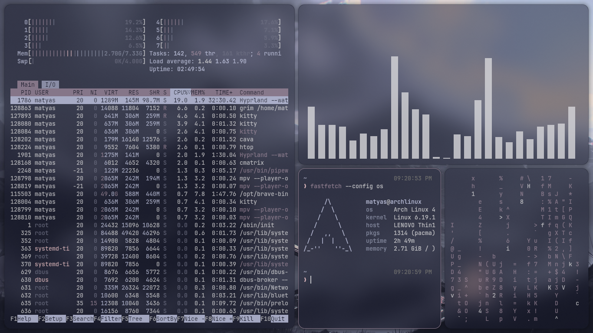
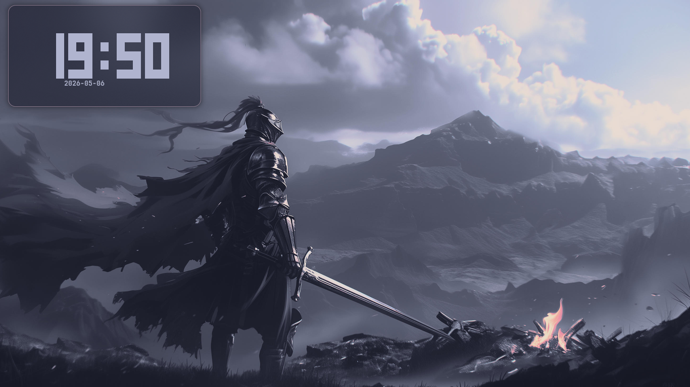
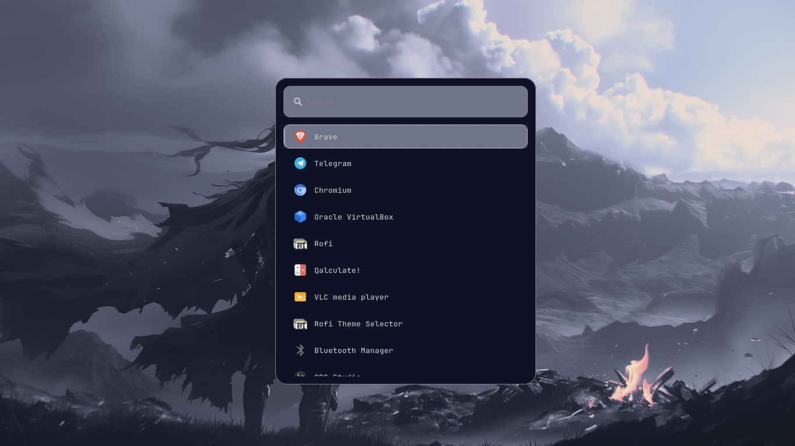
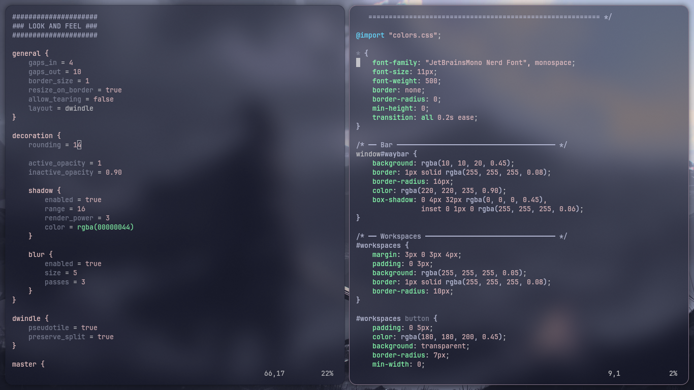
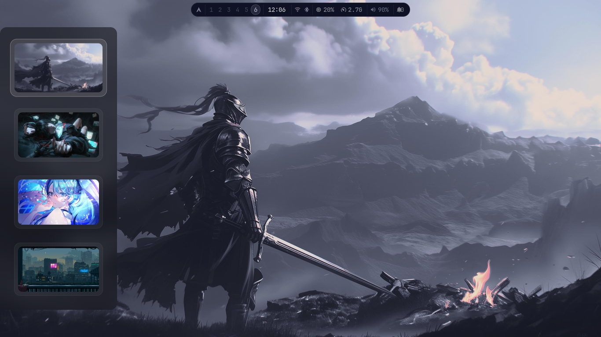

# MASU Hyprland Installer v3.0

```
███╗   ███╗ █████╗ ███████╗██╗   ██╗
████╗ ████║██╔══██╗██╔════╝██║   ██║
██╔████╔██║███████║███████╗██║   ██║
██║╚██╔╝██║██╔══██║╚════██║██║   ██║
██║ ╚═╝ ██║██║  ██║███████║╚██████╔╝
╚═╝     ╚═╝╚═╝  ╚═╝╚══════╝ ╚═════╝
```

> A full Hyprland desktop rice installer with **Glassmorphism UI** and **Pywal dynamic color pipeline** — your entire desktop theme follows your wallpaper automatically.

**by [Matyas Abraham (Maty156)](https://github.com/Maty156)**

---

## Screenshots

# Preview


| Desktop | Wofi Launcher |
|---------|--------------|
|  |  |

| Workspace | Wallpaper Picker |
|-----------|-----------------|
|  |  |

---

## What's in v3.0 (Pro Upgrade)

- ⚡ **MASU Pro Engine** — faster parallel installation and `spinner` feedback
- 🕵️ **NVIDIA Detection** — auto-patches for NVIDIA hardware (env vars & fixes)
- 💎 **Glassmorphism v2** — refined Waybar with smoother blurs and glowing borders
- 🔗 **Ecosystem Sync** — automatically syncs colors with **MASU Terminal**
- 🎮 **Gaming Mode** — `SUPER+G` to toggle optimizations for maximum FPS
- 📏 **Smart Gaps** — auto-hide gaps when only one window is open
- ✦ **Matuwall panel picker** — wallpaper picker from the left edge (`SUPER+W`)
- ✦ **Full pywal pipeline** — everything follows your wallpaper automatically
- ✦ **awww wallpaper daemon** — smooth transitions and persistence
- ✦ **Hyprlock** — lock screen always syncs with current wallpaper
- **SDDM** — login screen matches your wallpaper and pywal colors
- **Smooth animations** — fluid window animations with bezier curves
- **Wallpaper persistence** — last wallpaper restores on every reboot
- **Volume & brightness OSD** — wob overlay bar for media keys
- **Spotify scratchpad** — `SUPER+Z` toggles Spotify in/out

---

## Dependencies

| Package | Purpose |
|---------|---------|
| `hyprland` | Window manager |
| `hyprlock` | Lock screen |
| `waybar` | Status bar |
| `wofi` | App launcher |
| `awww` | Wallpaper daemon |
| `matuwall` | GTK4 wallpaper picker panel |
| `dunst` | Notifications |
| `kitty` | Terminal |
| `python-pywal` | Dynamic color scheme generator |
| `wob` | Volume/brightness OSD |
| `rofi-wayland` | Application launcher |
| `grim` + `slurp` | Screenshots |
| `brightnessctl` | Brightness control |
| `playerctl` | Media control |
| `thunar` | File manager |
| `pavucontrol` | Audio control |
| `ttf-jetbrains-mono-nerd` | Font |
| `gtk4` + `libadwaita` + `gtk-layer-shell` | Matuwall dependencies |
| `jq` | JSON parsing |
| `imagemagick` | Image processing |

---

## Installation

```bash
git clone https://github.com/Maty156/masu-hyprland-installer.git
cd masu-hyprland-installer
bash install.sh
```

The installer will:
1. Detect your distro and install all dependencies
2. Back up your existing configs
3. Install all MASU configs and scripts
4. Clone and install Matuwall
5. Set up the awww wrapper for pywal integration
6. Run pywal on the default wallpaper
7. Configure SDDM and enable services

> Supports: **Arch**, **Manjaro**, **Ubuntu**, **Debian**, **Fedora**, **openSUSE**

After install, add your wallpapers to `~/wallpapers/` and reboot!

---

## Keybindings

| Key | Action |
|-----|--------|
| `SUPER + Q` | Terminal (kitty) |
| `SUPER + R` / `SUPER + SPACE` | App launcher (wofi) |
| `SUPER + W` | Wallpaper picker (matuwall panel) |
| `SUPER + Z` | Spotify scratchpad toggle |
| `SUPER + E` | File manager (thunar) |
| `SUPER + C` | Close window |
| `SUPER + F` | Fullscreen |
| `SUPER + V` | Toggle floating |
| `SUPER + SHIFT + V` | Float + center + resize to 900×600 |
| `SUPER + L` | Lock screen |
| `SUPER + Delete` | Sleep |
| `SUPER + SHIFT + Delete` | Lock + sleep |
| `SUPER + M` | Exit Hyprland |
| `SUPER + S` | Scratchpad |
| `SUPER + 1-0` | Switch workspace |
| `SUPER + SHIFT + 1-0` | Move window to workspace |
| `SUPER + arrows` | Move focus |
| `SUPER + SHIFT + arrows` | Move window |
| `SUPER + ALT + arrows` | Resize window |
| `Print` | Screenshot (fullscreen) |
| `SUPER + Print` | Screenshot (area select) |
| `XF86AudioRaiseVolume` | Volume up + OSD |
| `XF86AudioLowerVolume` | Volume down + OSD |
| `XF86AudioMute` | Mute + OSD |
| `XF86MonBrightnessUp` | Brightness up + OSD |
| `XF86MonBrightnessDown` | Brightness down + OSD |

---

## Pywal Color Pipeline

When you pick a wallpaper with `SUPER+W`, the following update automatically:

```
Wallpaper selected (matuwall)
        │
        ▼
   awww sets wallpaper
        │
        ▼
   pywal generates colors
        │
        ├──▶ Waybar module colors
        ├──▶ Wofi launcher colors
        ├──▶ Dunst notification colors
        ├──▶ Hyprland border color
        ├──▶ Hyprlock wallpaper
        ├──▶ SDDM login screen wallpaper + colors
        ├──▶ wob OSD colors
        └──▶ Terminal colors (cmatrix, cava, etc.)
```

---

## Adding Wallpapers

Drop any `.jpg`, `.png`, `.webp` images into `~/wallpapers/` then press `SUPER+W` to open the picker. The panel slides in from the left — click a thumbnail to apply instantly.

---

## Structure

```
masu-hyprland-installer/
├── install.sh
├── wallpapers/
│   └── wallpaper.jpg
└── configs/
    ├── hypr/
    │   ├── hyprland.conf
    │   ├── animations.conf
    │   ├── hyprland-colors.conf
    │   ├── hyprlock.conf
    │   └── scripts/
    │       ├── wallpaper-colors.sh   # pywal pipeline
    │       ├── wal-watcher.sh        # awww change detector
    │       ├── restore-wallpaper.sh  # startup restore
    │       ├── matuwall-toggle.sh    # SUPER+W toggle
    │       ├── hyprlock_wall.sh      # hyprlock sync
    │       ├── sddm-colors.sh        # SDDM color sync
    │       ├── spotify-toggle.sh     # scratchpad toggle
    │       ├── volume-up/down/mute.sh
    │       └── brightness-up/down.sh
    ├── waybar/config + style.css
    ├── wofi/config + style.css
    ├── rofi/selector2.rasi + theme.rasi
    ├── swaync
    │   ├── colors.css
    │   ├── config.json
    │   ├── sounds
    │   │   ├── dragon-studio-new-notification-3-398649.mp3
    |   │   └── universfield-new-notification-09-352705.mp3
    |   ├── sound.sh
    |   ├── style.css
    ├── wob/wob.ini
    ├── matuwall/config.json
    ├── fastfetch/config.jsonc
    └── wal/templates/
        ├── hyprland-colors.conf
        ├── colors-wofi.css
        ├── dunstrc
        └── wob.ini
```

---

## Credits

- Wallpaper picker by [Matuwall](https://github.com/naurissteins/Matuwall)
- Color pipeline powered by [pywal16](https://github.com/eylles/pywal16)
- Wallpaper daemon by [awww](https://codeberg.org/LGFae/awww)
- Installer structure inspired by [JaKooLit/Hyprland-Dots](https://github.com/JaKooLit/Hyprland-Dots)
- swaync notification 

---

## License

MIT — feel free to use, modify and share.
